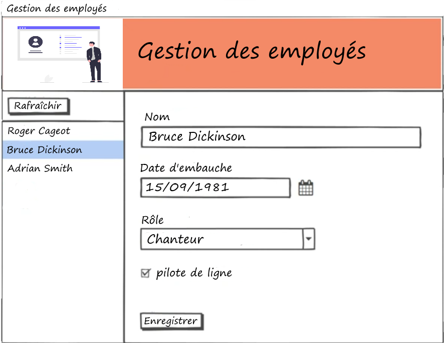

# Applications Desktop
Différentes solutions de création d'applications Desktop sous Windows ou Cross-platform

## Architecture de la solution

La solution Visual Studio sera composée de plusieurs projets, ceci afin de découpler correctement les différents modules de l'architecture :

- `GestionEmploye.Common` : contient les composants communs à d'autres projets, comme les classes POCO (_Plain Old C# Object_) qui accueilleront les données, et les interfaces qui permettront aux modules de communiquer de manière parfaitement découplée
- `GestionEmploye.DataAccess` : s'occupera de l'interaction avec la BDD
- les projets correspondants à la partie « Vue » de l'application (UI) ; chaque technologie UI approchée aura son (ou ses) propre(s) projet(s)

### Projet `GestionEmploye.Common`

- Nouveau projet : template _Class Library_ (pour C# et .NET Core)
  - on va utiliser pattern de nommage classique (`LaSolution.LeProjet`)
  - nom : `GestionEmploye.Common`
  - nom solution : `GestionEmploye`
  - **ne pas cocher** (notre solution va contenir plusieurs projets)
- Créer un répertoire `Model` dans le projet dans lequel vous aurez deux classes : `Employe` et `Role`

#### Classe `Employe`

Dans votre implémentation, vous choisirez des types appropriés pour toutes les variables.

- Créer la classe `Employe` avec les propriétés suivantes :
  - `Id`
  - `Prenom`
  - `Nom`
  - `DateEmbauche`
  - `EstPiloteDeLigne` (du moment que c'est un booléen)
  - `RoleId`

#### Classe `Role`

- Créer la classe `Role` avec les propriétés suivantes :
  - `Id`
  - `Nom`

#### Les interfaces

Une interface, au sens entité de POO, est une sorte de **contrat**. Elle définit les opérations (méthodes) qui seront disponibles sur les classes qui *implémenteront* cette interface. Ces méthodes sont déclarées **sans implémentation** : c'est le contrat. Lorsqu'une classe implémente l'interface, elle doit respecter son contrat, c'est-à-dire qu'elle *doit* fournir une implémentation pour toutes les méthodes de l'interface.

#### Interface `IEmployeDataProvider`

On va créer une interface pour pouvoir effectuer des opérations en BDD sur les employés. Cette interface sera implémentée dans un autre projet.

- Créer un autre répertoire `Interfaces`
- Créer l'interface `IEmployeDataProvider` avec les méthodes suivantes :
  - `ChargerEmployes()` renvoie une collection d'employes
  - `SauvegarderEmploye(Employe)` permet de sauvegarder un employé
  - `ChargerRoles()` renvoie une collection de roles

### Projet `GestionEmploye.DataAccess`

- Créer un autre projet, toujours de type _Class Library_
- Ajouter une dépendance sur le projet `GestionEmploye.Common`
- Créer une classe `EmployeDataProvider`
  - elle implémente l'interface `IEmployeDataProvider` de l'autre projet (d'où la dépendance)
  - et donc elle doit fournir une implémentation pour chaque méthode déclarée dans cette interface
- `ChargerEmployes()` : renvoie une collection d'employés construite avec un jeu de données générées « en dur » (pas d'accès effectif en BDD dans cette phase)
- `SauvegarderEmploye()` : ne va rien faire d'effectif (pas d'accès BDD) ; juste une sortie console pour « loguer » le fait qu'elle ait été appelée
- `ChargerRoles()` : idem, renvoie une collection de rôles codés « en dur »

Plus tard, nous verrons comment utiliser l'ORM Entity Framework Core pour accéder à une BDD, ou encore comment utiliser une API via HTTP pour récupérer des données. L'avantage de l'interface est ici que l'on pourra facilement changer de composant d'accès aux données par la suite, sans rien modifier dans les autres projets : ceux-ci utiliseront l'interface, et l'implémentation réelle existante derrière cette interface leur importe peu, du moment que le service est rendu (_black box_).

Cette partie se concentre donc sur les solutions d'interfaces graphiques uniquement.

## Prototype d'une UI avec WinUI

### Mise en place

- VS 2019 : _.NET Desktop Development_ doit avoir été sélectionné à l'installation
- Installer **Extension VS** : *Project Reunion* (nom officiel à venir : _Windows App SDK_)
  - contient _templates_ de projets et bibliothèque WinUI
  - fermer VS pour lancer l'installation
  - détails : https://docs.microsoft.com/windows/apps/winui

### Création du projet d'interface WinUI

- Dans notre solution, ajouter un projet _Blank App, Packaged (WinUI 3 in Desktop)_
  - (si template absent, vérifier l'installation de l'extension précédente)
  - nom : `GestionEmploye.WinUI`
  - laisser valeurs par défaut pour les cibles
- Deux projets sont créés :
  - _WinUI_ : contiendra la partie interface graphique de votre application
  - _WinUI (Package)_ : dans lequel sera généré le fichier de déploiement (package MSIX, le format Windows 10)
  - (il est possible qu'on vous demande d'activer le mode développeur de W10)
- Faire du projet _Package_ le projet de démarrage (clic-droit)

### Test du template

- Le projet est actuellement constitué de 4 fichiers :
  - deux fichiers XAML :
    - `App.xaml` : le code de « démarrage » de l'application
    - `MainWindow.xaml` : la fenêtre principale
  - et deux fichiers C# (`.cs`) correspondants
    - appelés _code-behind_ (« le code derrière » l'interface écrite en XAML)
    - noter que les deux fichiers XAML référencent ces classes par l'intermédiaire de l'attribut `x:Class` en début de fichier
- Lancer l'application (bouton _Play_)
  - si erreur de déploiement : _Build/Configuration Manager_, cocher les _Build_ et le _Deploy_
  - le template est très simple : un bouton qui, cliqué, change de texte
- Examiner le code de `MainWindow` et comprendre la mise en page du bouton et l'interaction entre l'interface XAML et le _code-behind_ qui gère l'événement du clic

## Layout en XAML

- Les deux containers principaux qui permettent de ranger et d'agencer les autres _controls_ sont :
  - `StackPanel` : très simple, les _controls_ sont empilés horizontalement ou verticalement ([doc](https://docs.microsoft.com/fr-fr/uwp/api/windows.ui.xaml.controls.stackpanel?view=winrt-22000))
  - `Grid` : les _controls_ sont rangés dans une grille virtuelle (tableau) ([doc](https://docs.microsoft.com/fr-fr/uwp/api/Windows.UI.Xaml.Controls.Grid?view=winrt-22000)) ; assurez-vous de comprendre notamment comment la taille des rangées/colonnes est spécifiée (`*`, `auto` ou nombre fixe de pixels)
  - ces containers peuvent être imbriqués pour créer un layout complexe
  - les propriétés notables `Width`, `Height`, `Margin`, `Padding`, `HorizontalAlignment`, `VerticalAlignment` d'un élément permettent de raffiner son placement
- [Documentation générale pour le layout](https://docs.microsoft.com/en-us/windows/apps/design/layout/layout-panels#stackpanel)
- En fait de nombreux concepts HTML sont repris et adaptés aux applications desktop

## Layout de l'application démo

Comment découper cet écran pour organiser le layout ?



- Implémenter l'écran en XAML

## Le pattern MVVM

- MVVM = Model-View-ViewModel
- Pattern principal de liaison UI<->Data dans les frameworks basés sur XAML (et maintenant dans d'autres frameworks comme Angular)
- Le ViewModel (VM) s'intercale entre la View (Vue) et le Model (Données) pour les découpler
- Le VM utilise le Model, expose *seulement* les propriétés dont sa vue a besoin (d'où le nom : _ViewModel_)
* Les propriétés des éléments côté Vue sont _bindées_ (liées) à des propriétés du VM : c'est le *databinding*
* Le VM doit implémenter l'interface `INotifyPropertyChanged` pour que cela fonctionne automatiquement avec la vue en XAML
* Ainsi, le VM va _notifier_ la Vue quand une de ses propriétés change
* La Vue est mise à jour automatiquement
* Le pattern peut fonctionner aussi dans l'autre sens : quand une donnée bindée sur la View est modifiée, le VM peut être notifié (et sauvegarder automatiquement si besoin)
* Le VM peut aussi contenir des méthodes qui vont être exécutées par la Vue, par exemple `Sauvegarder()` quand on va cliquer sur le bouton ; cette _commande_ peut aussi être bindée
* Le VM est rendu indépendant de l'UI : il pourra être utilisé avec WinUI, WPF, WinForms, et MAUI
* C'est pourquoi les VMs sont en général placés dans un projet indépendant

## MVVM - Implémentation

### ViewModel pour `Employe`

- Ce VM va s'occuper de la partie droite de notre UI : les détails d'un employé
- Créer un nouveau projet `GestionEmploye.ViewModels` (.NET 5 toujours)
- Classe `EmployeViewModel`
  - constructeur qui initialise un `Employe` (Model) reçu en paramètre, ainsi qu'un `IEmployeDataProvider`
  - propriétés `Nom`, `Prenom`, `DataEmbauche`, `RoleId`, `EstPiloteDeLigne`
- Chacune des propriétés va être bindée dans la View : toute modification de la valeur d'une propriété doit être notifié ; cela se passe dans le setter qui, après mise à jour de la valeur, doit lancer l'événement `PropertyChanged`
- Cet événement est défini dans l'interface `INotifyPropertyChanged`
  - ajouter la mention de l'interface au niveau de la classe (laisser ensuite VS faire l'importation nécessaire avec `Ctrl+.`)
  - utiliser de nouveau VS pour implémenter l'interface automatiquement : l'événement est ajouté dans la classe
- Définir ainsi la méthode `RaisePropertyChanged()` :

```c#
private void RaisePropertyChanged([CallerMemberName] string nomPropriete = null)
{
  PropertyChanged?.Invoke(this, new PropertyChangedEventArgs(nomPropriete));
}
```

- Cette méthode lance l'événement à destination des Views qui sont bindées : « cette propriété (`nomPropriete`) a changé »
- Appeler cette méthode dans tous les setters de vos propriétés bindées
- Créer la méthode `Sauvegarder()`
  - elle délègue la sauvegarde au `IEmployeDataProvider` de la classe (injecté dans le constructeur)

### ViewModel pour `MainWindow`

- Ce VM va s'occuper de toute la vue « maître/détails »
  - il lui faudra donc la liste de tous les employés sous forme de ViewModels afin de passer le bon VM à la vue détail
  - ainsi qu'une propriété sélectionné pour savoir quoi afficher dans la partie détails
- Créer un VM `MainWindowViewModel` qui implémentera `INotifyPropertyChanged` comme précédemment
- Créer les propriétés `Employes` et `Roles` sous forme d'`ObservableCollection` (liste spéciale qui va automatiquement notifier des changements)
  - `Role` pourrait être sur le VM `Employe` mais comme ce sont les mêmes rôles pour tous les employés et qu'ils ne sont pas éditables, on choisit de déplacer cette fonctionnalité commune dans la `MainWindow`
- Créer la propriété `EmployeSelectionne`
- Créer la méthode `Charger()` (elle répondra au bouton « Rafraîchir » de la vue)
  - de nouveau, on va déléguer au `DataProvider` (qu'il faudra injecter dans le constructeur) pour charger les employés et les rôles
  - puis peupler nos collections de VMs `Employes` et `Roles` à partir des données reçues

## Databinding

- On va maintenant raccorder les « branchements » côté interface graphique : il s'agit donc de connecter la View et le ViewModel
- Cela se fait en initialisant le VM dans le _code-behind_ et en utilisant l'extension markup `x:Bind` dans le XAML
- Dans le _code-behind_ de `MainWindow`, instancier le VM correspondant : ce sera la propriété `ViewModel`
- Dans la partie XAML, relier le clic du bouton « Rafraîchir » à la méthode `Charger()` du VM en utilisant `{x:Bind}`
- Binder la `ListView` d'employés ; il faut brancher trois choses :
  - `ItemsSource` : d'où viennent les éléments de la liste ?
  - `SelectedItem` : relié à la propriété qui connaît l'élément sélectionné
  - `DisplayMemberPath` : quelle propriété des éléments source doit être affichée dans la `ListView` ?
- Binder la date
  - propriété `SelectedDate`
- Binder le rôle
  - `ItemsSource` : binding sur les rôles eux-mêmes
  - `DisplayMemberPath` : la propriété indiquant le texte à afficher pour chaque élément
  - `SelectedValuePath` : la propriété qui identifie la sélection de manière unique sur le rôle
  - `SelectedValue` : binding sur la propriété de l'objet `Employe` sélectionné qui correspond à cette valeur
- Binder la checkbox
  - `IsChecked` : bindé sur le booléen de l'employé sélectionné
- Binder l'événement `Click` du bouton à la méthode `Sauvegarder()` de l'employé sélectionné
- Finalement, on va s'assurer que la liste d'employés est chargée au moment de l'activation de la fenêtre :
  - dans le constructeur, s'abonner à l'événement `Activated`
  - dans la méthode _handler_ de l'événement, appeler la méthode `Charger()` sur le ViewModel

## Test de l'application

Vérifier le bon chargement de la liste à l'exécution, les différents databindings, le rafraîchissement, la console de débogage lors d'un pseudo-enregistrement...

## Activation/désactivation automatique d'un élément

- On souhaite désactiver le bouton `Sauvegarder` quand le champ _Nom_ ou _Prenom_ est vide dans l'UI
- Il nous faut une propriété booléenne `PeutSauvegarder`
  - elle dira si oui ou non la sauvegarde est autorisée
  - la propriété `IsEnabled` du bouton sera ensuite bindée à cette propriété `PeutSauvegarder`
- Faire le même type de traitement pour cacher la partie « détails » lorsqu'aucun employé n'est sélectionné

## ViewModelBase

- Une partie du code de « plomberie » MVVM sera présente dans tous les VMs :
  - ils implémentent l'interface `INotifyPropertyChanged`
  - ils possèdent une méthode `RaisePropertyChanged()`
- Extraire ce code dans une classe `ViewModelBase` en utilisant l'héritage

## Prototype d'une UI avec WPF

- Rappel : WPF = UI pour Windows seulement, mais on n'est pas limité à W10
- Très similaire à WinUI (XAML + _code-behind_ + MVVM et databinding)
- On va reprendre le projet de gestion d'employés, en réutilisant complètement les bibliothèques communes déjà écrites (`Common`, `DataAccess`, `ViewModels`), et en reprenant le code XAML WinUI qui sera très similaire
- L'une des différences principales est que l'on a accès à un designer visuel sous VS qui reflète immédiatement les changements du code XAML, et également de travailler en mode _glisser-déposer_ si on le souhaite
- D'autres concepts XAML et MVVM seront intégrés :
  - le _converter_, qui permet de transformer une donnée brute provenant du Model en donnée exploitable pour l'affichage dans la View (exemple : une température stockée en celsius et affichée en fahrenheit)
  - les _commands_ MVVM qui permettent de binder l'action d'un élément à une méthode
  - ces concepts s'appliquent également aux interfaces WinUI, MAUI...

### Mise en place

- WPF est intégré depuis longtemps aux projets Desktop de VS, donc tout est déjà en place, on va ajouter un projet spécifique WPF à notre solution

### Création du projet d'interface WPF

- Dans notre solution, ajouter un projet _WPF Application_ (pour .NET Core)
  - nom : `GestionEmploye.WPF`
  - Target .NET 5
- Un seul projet et créé (contrairement à WiUI)
  - la structure est très similaire à celle du projet `WinUI`
- Faire du projet WPF le projet de démarrage
- Ajouter un simple `TextBlock` dans la `MainWindow` pour avoir quelquechose à visualiser
- Lancer l'application-test pour vérifier que tout est bien en place

### Reprise de l'interface existante

- Copier l'intégralité de l'élément `Grid` principal de la `MainWindow` du projet WinUI
- Le coller comme élément principal de la `MainWindow` WPF
- Il faut modifier quelques petites choses :
  - WPF ne supporte pas le binding à un événement : les clics sur les boutons ne réagiront pas, les supprimer (on utilisera des _Commands_ à la place)
  - utiliser `Binding` à la place de `x:Bind` ; de plus `Binding` ira directement chercher dans la source, on peut enlever la mention `ViewModel` du chemin
  - les propriétés `Header` des éléments n'existent pas en WPF : à la place, ajouter des lignes à la Grid pour accueillir des `TextBlock` qui feront office de headers pour nos `TextBox`
- Tester la bonne mise en place de l'interface (mais les databindings ne fonctionnent plus ; noter cependant que cela ne provoque pas d'erreurs d'exécution)

### Databindings en WPF

- On a supprimé, dans le XAML, les mentions à notre variable `ViewModel` qui était initialisée dans le _code-behind_
- C'est parce que `{Binding}` et `{x:Bind}` ne fonctionnent pas de la même manière
- Voici les différences :

| `{Binding}`                      | `{x:Bind}`                      |
| -------------------------------- | ------------------------------- |
| `"{Binding Employes}"`           | `"{x:Bind ViewModel.Employes}"` |
| WPF ? Oui                        | WPF ? Non                       |
| WinUI ? Oui                      | WinUI ? Oui                     |
| résolution à l'exécution         | résolution à la compilation     |
| source = propriété `DataContext` | source = objet associé au XAML  |

- En WPF donc, on n'a pas le choix pour le databinding
- La résolution à la compilation montrera les erreurs potentielles immédiatement (et sera également un poil plus rapide)
- En WinUI on avait défini et initialisé la propriété `ViewModel` que l'on utilisait ensuite dans le XAML pour le binding ; avec WPF il faut à la place initialiser la propriété prédéfinie `DataContext`
- Dans le constructeur du _code-behind_, instancier un `MainViewModel` dans une variable d'instance privée appelée `viewModel`, puis l'affecter à la propriété prédéfinie `DataContext`
- => Les bindings iront alors automatiquement se « brancher » sur le VM instancié
  - par exemple, `{Binding Employes}` va chercher une propriété `Employes` sur le DataContext, et va la trouver car le ViewModel possède bien une telle propriété
  - rappel : en WPF, si un binding échoue, aucune erreur n'est générée, ni à la compilation, ni à l'exécution ; il est en revanche possible de constater les problèmes (_Debug/Windows/XAML Binding Failures_)

### Chargement des données

- Avant de s'occuper des _Commands_ pour binder des méthodes à des actions, on va faire en sorte que les données se chargent au lancement de la fenêtre
- Dans le _code-behind_, remettre en place le mécanisme d'abonnement à l'événement d'activation de la fenêtre afin de charger les données fictives au lancement

### Test

- Lancer l'application pour vérifier le chargement des données et les databindings
- Tout devrait presque fonctionner :
  - les boutons ne sont pas encore « branchés »
  - le binding des dates ne fonctionnent pas

### Fixer le databinding sur le DatePicker

- Pendant que l'application tourne, ouvrez la fenêtre `XAML Binding Failures` et constater les problèmes
- On va d'abord s'occuper du problème de conversion sur le `DatePicker` : il s'attend à avoir un `DateTime` et il a un `DateTimeOffset`
- Ajouter une propriété similaire à `DateEmbauche` sur le VM mais faites en sorte qu'elle soit de type `DateTime`
- Tester, le datepicker doit maintenant fonctionner correctement
- Il reste un problème de binding au niveau de la visibilité du panel « détails »

### Fixer le databinding sur la visibilité de la partie « détails » - le _Converter_

- l'erreur nous indique qu'on ne peut pas convertir un booléen en une valeur du type `System.Windows.Visibility`
- Notre propriété `UnEmployeEstSelectionne` (censée contrôler la visibilité du panel) est bien un booléen
- Mais WPF s'attend à avoir le type spécifique `System.Windows.Visibility` pour la propriété `Visibility` de l'élément
- On pourrait utiliser la même approche que précédemment, en ajoutant une propriété du bon type et en faisant la conversion soi-même dans le getter, mais on va utiliser un mécanisme intégré à WPF : le **_Converter_**
- WPF possède un _Converter_ prédéfini qui permet de convertir un booléen en type `Visibility`
- Il faut déclarer qu'on va l'utiliser en ajoutant une ressource dans `App.xaml` :

```xml
<Application.Resources>
  <BooleanToVisibilityConverter x:Key="MyBooleanToVisibilityConverter" />
</Application.Resources>
```

- Une ressource est associée à une clé (un nom qui désignera la ressource dans notre code) par l'intermédiaire de l'extension markup `x:Key`
- On peut alors utiliser cette ressource dans notre UI principale en utilisant l'extension markup `StaticResource` :

```xml
{Binding UnEmployeEstSelectionne, Mode=OneWay,
  Converter={StaticResource MyBooleanToVisibilityConverter}}
```

- NB1 : on peut aussi créer des _converters_ nous-mêmes, pour gérer des scénarios moins classiques (on crée une classe qui implémente l'interface `IValueConverter`)
- NB2 : en WinUI avec `x:Bind`, ça fonctionne directement car la conversion est automatique ; mais WinUI peut aussi utiliser les _converters_ (prédéfinis ou pas)
- Tester (le panneau « détails » doit maintenant être caché au lancement) ; vérifier que plus aucune erreur de binding n'est reportée

### Gestion des clics

- En WinUI, on liait l'événement `Click` d'un bouton en XAML à une méthode dans le VM
- En WPF, ce type de binding n'est pas supporté
- Deux solutions :
  - créer un _handler_ pour l'événement `Click` dans le _code-behind_ (méthode « à l'ancienne », utilisée dans WinForms) : pas très en phase avec le pattern MVVM qui vise à avoir le moins de code possible dans le _code-behind_...
  - utiliser la propriété `Command` du bouton : c'est ce qu'on va faire ici

### MVVM et _Commands_

- Les _commands_ vont nous permettre de réaliser le binding entre une action sur un élément graphique et une méthode associée sur le VM
- Processus :
  1. Créer une classe qui implémente l'interface `ICommand`
  2. Créer et paramétrer une propriété de ce type dans le VM
  3. Utiliser cette propriété pour le binding en XAML

#### L'interface `ICommand`

- Voici un exemple de classe standard qui implémente l'interface `ICommand` :

```c#
public class DelegateCommand : ICommand
{
  private readonly Action _execute;
  private readonly Func<bool> _canExecute;

  public DelegateCommand(Action execute, Func<bool> canExecute = null)
  {
    _execute = execute ?? throw new ArgumentNullException(nameof(execute));
    _canExecute = canExecute;
  }

  public event EventHandler CanExecuteChanged;

  public void RaiseCanExecuteChanged()
  {
    CanExecuteChanged?.Invoke(this, EventArgs.Empty);
  }

  public bool CanExecute(object parameter)
  {
    return _canExecute == null
      ? true
      : _canExecute();
  }

  public void Execute(object parameter)
  {
    _execute();
  }
}
```

- Ajouter cette classe dans le projet `ViewModels`, dans un répertoire `Command`
- Les détails de fonctionnement de cette classe « plomberie » ne nous intéressent pas ici, on va juste l'utiliser (il y a plusieurs façons de l'implémenter, des versions sont notamment disponibles dans des bibliothèques open source spécialisées MVVM)
- On va pouvoir créer des objets de ce type dans nos VMs, pour créer des _commands_ relativement facilement

#### Bouton « Rafraîchir » - action seulement

- Commençons par le chargement des données qui doit être effectué à chaque appui sur le bouton « rafraîchir »
- Dans le constructeur du VM,instancier un objet `DelegateCommand` appelé `ChargerCmd` qui permettra le binding entre un élément de l'UI et la méthode `Charger` (il faudra passer la méthode `Charger` en paramètre du constructeur)
- Côté XAML, on peut maintenant lier la propriété `Command` du bouton à notre _command_ du ViewModel
- Tester

#### Bouton « Sauvegarder » - action + activation/désactivation

- Réaliser le même type de traitement pour lier le bouton `Sauvegarder` à la méthode `Sauvegarder` de `EmployeViewModel` avec une commande appelée `SauvegarderCmd`
  - on pourra passer la méthode `PeutSauvegarder` en deuxième paramètre du constructeur de `DelegateCommand` (utiliser une _lambda expression_)
  - appeler `SauvegarderCmd.RaiseCanExecuteChanged()` quand une propriété change et qu'elle pourrait modifier l'état de `PeutSauvegarder`
  - on n'aura alors plus besoin de binder la propriété `IsEnabled` du bouton

### WPF - Conclusion

- Nombreuses similarité avec WinUI, quelques différences cependant qui ne permettent pas de partager complètement le code XAML de l'interface
- Les VMs, en revanche, peuvent être adaptés pour être utilisés par les deux technologies avec le pattern MVVM
- `Binding` uniquement, avec `DataContext`, `x:Bind` non supporté
- Les échecs de bindings n'empêchent pas l'application de tourner, mais ces erreurs sont reportées dans l'IDE à l'exécution
- Les _converters_ permettent d'adapter une propriété du VM à un type de donnée attendu par XAML ; on peut utiliser les _converters_ prédéfinis et en définir nous-mêmes
- Pour les actions, les _commands_ demandent plus de « plomberie » que les bindings directs mais sont également plus flexibles et puissantes (gestion activation/désactivation) ; on peut utiliser les _commands_ dans WinUI également

## Prototype d'une UI avec Windows Forms

- WinForms (2002, intégré à .NET Core en 2016) n'utilise pas XAML
- L'interface graphique est générée directement par du code C# qui instancie les éléments, les placent au bon endroit, lie les événements, etc.
- Mais en général on ne code pas soi-même ce code UI, on utilise le _Windows Forms Designer_ qui permet de construire une UI par « glisser-déposer »
- WinForms permet également une gestion du databinding, mais pas de la même forme et moins puissante qu'en XAML/MVVM ; on pourra néanmoins réutiliser nos VMs existants

### Mise en place

- Comme pour WPF, WinForms est intégré directement à VS, on va ajouter un projet spécifique WinForms à notre solution

### Création du projet d'interface WinForms

- Dans notre solution, ajouter un projet _Windows Forms App_ (attention, pas _.NET Framework_)
  - nom : `GestionEmploye.WinForms`
  - Target .NET 5
- Un seul projet et créé
- Renommer (F2) `Form1.cs` en `MainForm.cs`
- La structure est différente de ce qu'on a vu :
  - plus de XAML
  - `Program.cs` : démarrage du programme, se charge notamment d'instancier la fenêtre de démarrage et de la lancer
  - `MainForm.cs` : au double-clic, lance automatiquement le _Windows Forms Desgner_ sur cette fenêtre principale
  - pour voir le code-behind (classe _partial_, en plusieurs fichiers), clic-droit, _View code_  : c'est ce fichier que l'on va modifier pour la partie logique
  - raccourcis `F7` et `Shift-F7` pour passer du designer au _code-behind_
  - `MainForm.Designer.cs` : autre partie (_partial_) de notre _form_, celle qui contient le code généré par le designer (en général on ne **touche pas** à ce fichier, sauf pour corriger des erreurs éventuelles dues à une manipulation du code que ne contrôle pas le générateur)
- Faire du projet WinForms le projet de démarrage
- Lancer l'application-test pour vérifier que la fenêtre (vide) s'affiche correctement

### Découverte du _Windows Forms Designer_

- Ouvrir la _Toolbox_ si elle n'est pas disponible (_View/Toolbox_)
  - elle contient tous les _controls_ disponibles pour WinForms, par exemple les _containers_ qui permettent de contenir d'autres éléments
  - noter qu'ils sont différents de ceux que vous connaissez en XAML (comme le `StackPanel` ou la `Grid`)
  - c'est pourquoi il est plus compliqué d'obtenir une interface qui s'adapte facilement en WinForms : il faut bouger tous les éléments sur le designer dès que l'on change la disposition (en XAML, les _controls_ s'adaptent automatiquement aux modifications de code)
- Glisser-déposer un bouton dans la fenêtre
- Le déplacer dans la fenêtre ; noter comment, près des bords, l'élément vient se placer automatiquement par rapport aux marges qui sont définies dessus
- Pour contrôler ces marges ainsi que d'autres propriétés du _control_, ouvrir le panneau _Properties_
- Explorer un peu les propriétés de l'élément sélectionné et les boutons du panneau
  - on peut classer les propriétés par catégories ou par ordre alphabétique
  - on peut aussi voir les événements qui peuvent être associés à l'élément
- Changer le titre de la fenêtre

### Événements

- L'interaction en WinForms fonctionne donc principalement sur la base d'événements auxquels vont réagir directement des méthodes dans le _code-behind_
- Reprenons notre bouton et disons que l'on veut en faire notre bouton « Sauvegarder » ; on va le plus souvent utiliser le processus suivant :
  - le renommer : on utilise en général le pattern de nommage `abbreviationControl_Description` ; ici, ça donnera `btn_Sauvegarder`
  - le nommage est important :
    - on pourra se référer à ce bouton dans le _code-behind_
    - le nom des méthodes d'événements associés générées contiendront le nom de l'élément
  - changer son texte (_Sauvegarder_)
  - trouver son événement _Click_, doucle-cliquer dessus : cela va créer l'abonnement à l'événement et la méthode `btnSauvegarder_Click` dans le _code-behind_ (pattern de nommage automatique : `nomControl_Evenement`)
  - dans la méthode générée, accéder programmatiquement aux propriétés du bouton pour modifier son texte, comme dans la démo WinUI
  - tester si le clic fonctionne alors comme prévu
- Examiner le code généré dans `MainForm.Designer.cs` pour avoir une idée de ce qui est construit lorsque l'on ajoute et configure des _controls_ et que l'on branche des événements

### Construction de l'interface

- Construire l'interface de l'application « Gestion des employés »
  - travailler avec le designer, le panneau « toolbox » et le panneau « propriétés »
  - utiliser des _panels_ comme container pour regrouper des _controls_
  - suggestion : utiliser trois panels pour les trois parties principales de l'interface
  - ne pas oublier de renommer systématiquement tous les _controls_ utilisés
- Pour maintenir le layout lors du redimensionnement de la fenêtre, utiliser les propriétés `Dock` et `Anchor` des éléments
  - `Dock` permet de « docker » (« magnétiser ») un élément sur un bord du container englobant ou de lui faire prendre tout l'espace disponible
    - ex. : les différents panneaux de VS (_Solution Explorer_, _Toolbox_...) sont en général dockés sur le côté gauche ou droit ; le panneau d'erreurs est souvent docké en bas ; l'éditeur de code est docké en `Fill` (« remplir »), pour prendre toute la place restante
  - `Anchor` permet « d'accrocher » l'élément par rapport à son conteneur
    - ex. : un groupe de boutons « Annuler/OK » est souvent ancré en bas à droite => si la fenêtre conteneur change de taille, les boutons restent en bas à droite
    - si on ancre à gauche et à droite, par exemple, le _control_ va se redimensionner pour toujours rester à même distance des bords gauche et droit de son conteneur
- On peut utiliser le `Document Outline` pour sélectionner facilement des _controls_ sans avoir à cliquer dessus sur le designer (parfois compliqué et frustrant lorsque l'interface commence à être chargée)

### Databinding avec WinForms

- La _form_ aura un objet de type `BindingSource`
  - il encapsule la source de données (que l'on va fournir) dans une propriété de type `DataSource`
  - la propriété `Current` permet de savoir quel objet de la data source est actuellement sélectionné
- On va instancier un `MainViewModel` (notre classe existante) et affecter au `DataSource` la propriété `Employes` de ce VM
  - cette propriété `Employes` est de type `ObservableCollection<EmployeViewModel>`
  - => la source de données pour la _form_ sera donc la liste des VM des employés chargés dans le VM
- On va ensuite affecter à la propriété `DataSource` de la _ListBox_ le _BindingSource_ ainsi construit
- La _ListBox_ sera connectée au _BindingSource_ lui-même connecté aux employés du `MainViewModel`
- Comme c'est une collection observable, toute modification dans cette collection sera automatiquement connue du _BindingSource_, qui mettra automatiquement à jour la _ListBox_
- On pourra ensuite binder les propriétés des _controls_ à des propriétés du VM employé courant du _BindingSource_ (`Current.Prenom`...) ; c'est ce qu'on va faire dans la partie « Détails »
- Pour l'activation/désactivation des boutons, on binde la propriété `Enabled` à une méthode `PeutXXX`
- Tout devra se faire en grande partie en C# :
  - par exemple : `txtPrenom.DataBindings.Add("Text", bindingSource, "Prenom");` binde la propriété `Text` de la _TextBox_ `txtPrenom` à la propriété `Prenom` de l'élément courant de `bindingSource`
  - on pourra cependant pour instancier la source utiliser de nouveau la _toolbox_ qui possède un composant `BindingSource` que l'on peut déposer sur la fenêtre et configurer sur le panneau `Properties`
- Tout cela représente un peu les prémisses du pattern MVVM qui sera formalisé et généralisé plus tard avec XAML

### Implémentation du databinding

#### Chargement des données

- S'arranger pour l'avoir à l'activation de la fenêtre

#### Création du `BindingSource`

- Glisser un `BindingSource` dans la fenêtre ; le nommer
- Dans le _code-behind_, configurer sa `DataSource`

#### Connexion à la _ListBox_

- On va maintenant connecter la _ListBox_ au _BindingSource_
  - cela peut se faire programmatiquement
  - ou en utilisant les propriétés de la _ListBox_, qui a directement accès au _BindingSource_ de la fenêtre
  - il s'agit en tout cas de configurer correctement son `DataSource` et son `DisplayMember` (la propriété qui va être affichée dans la liste, en l'occurrence le nom de l'employé)

#### Binding de la partie « détails »

- Brancher les bindings sur la partie « détails », sauf la _ComboxBox_ (voir ci-dessous)
- En testant, on doit vérifier que :
  - les détails sont bien synchronisés à l'employé sélectionné
  - si on change le nom, le nom dans la liste change aussi (il faudra utiliser une surcharge spéciale de `DataBindings.Add` pour que cela soit immédiat)
  - le bouton _Sauvegarder_ se désactive quand la validation n'est pas OK

#### Cas particulier : la _ComboBox_

- La configuration d'une _ComboBox_ en WinForms ressemble à celle de WPF/WinUI, mais les noms des propriétés sont différents
- Poser sa `DataSource` à la liste des rôles dans le `MainViewModel` (équivalent `ItemsSource` dans WPF/WinUI)
- Poser son `DisplayMember` à `"Nom"` (le nom du rôle, c'est ce qu'on doit afficher dans la box, équivalent `DisplayMemberPath`)
- Maintenant la _ComboBox_ permettra de sélectionner parmi les différents rôles
- Ensuite il faut binder sa valeur au rôle effectif de l'employé sélectionné
  - `ValueMember` : la propriété qui identifie la sélection de manière unique sur le rôle (équivalent `SelectedValuePath`)
  - `SelectedValue` : binding (donc avec `DataBindings`) sur la propriété de l'objet `Employe` sélectionné qui correspond à cette valeur (équivalent `SelectedValue`)
- Maintenant la _ComboBox_ a une liste de rôles, et sa sélection est bindée à l'employé sélectionné par l'intermédiaire de la propriété `Id` du rôle
- NB : pour forcer la _ComboBox_ à ne sélectionner que les éléments prédéfinis de la liste de rôle, changer sa propriété `DropDownStyle` (actuellement on peut taper ce qu'on veut)

### Bouton « Rafraîchir »

- Ajouter la gestion du clic sur le bouton « Rafraîchir »
  - il faut charger les données
  - et réinitialiser les bindings sur le _BindingSource_ avec la méthode `ResetBindings`

### Bouton « Sauvegarder »

- Ajouter la gestion de la prétendue sauvegarde
  - il faudra explicitement convertir la propriété `Current` du _BindingSource_ en un `EmployeViewModel` pour pouvoir appeler sa méthode `Sauvegarder`

### WinForms - Conclusion

- Le _Windows Forms Designer_ permet de créer des interfaces graphiques facilement sans connaître de langage particulier comme XAML
- Inconvénient majeur : parfois, la modification d'une petite partie de l'interface entraîne le remaniement manuel de nombreux _controls_
- Le databinding, bien qu'existant, est moins évolué et demande plus de code qu'en WPF ou WinUI
- Cela reste cependant une solution privilégiée par de nombreux développeurs Windows, notamment lorsqu'ils ont besoin de créer une interface basique facilement et rapidement, mais pas seulement

